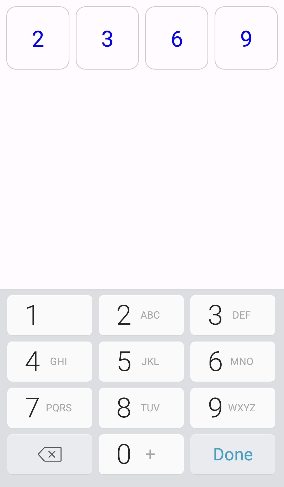
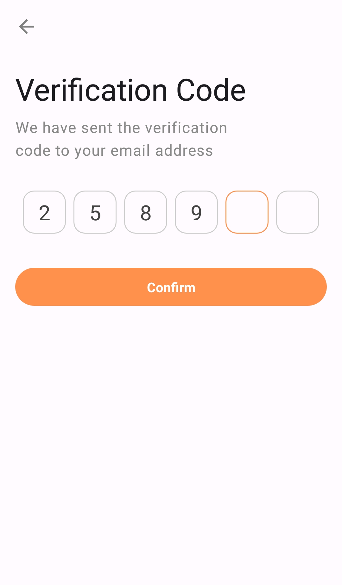

OtpViewCompose
===============

A beautiful material desinged otpView for your verification feature and you can customize it to match with your design.

<div align="center">
  <table>
    <tr>
      <td align="center">
        
      </td>
      <td align="center">
        
      </td>
      <td align="center">
        
      </td>
    </tr>
  </table>
</div>

Add Dependency
------
first add jitpack to your **dependencyResolutionManagement**

```
dependencyResolutionManagement{
    ...
    maven { url = uri("https://jitpack.io") }
}
```
then add the dependency
```
dependencies {
    ...
    implementation("com.github.mahdihassani-dev:OtpViewCompose:1.0")
}
```


Usage
------

*basic usage*
```kotlin
val otpText = remember {
        mutableStateOf("")
    }
    
OtpView(otpText = otpText.value) { it, isFilled ->
        otpText.value = it
        //isFilled is true when cells are filled with numbers
    }
```
*custom usage*
```kotlin
OtpView(
    otpText = otpText.value,
    borderFocusedColor = Color.Black, //color when focus on a cell
    textColor = Color.DarkGray, //text color
    modifier = Modifier.padding(bottom = 24.dp), //modifier for whole view
    otpCount = 6, //size of cells
    textStyle = MaterialTheme.typography.titleLarge //text style
        )
    { it, isFilled->
         otpText.value = it
    }
```


License
-------

